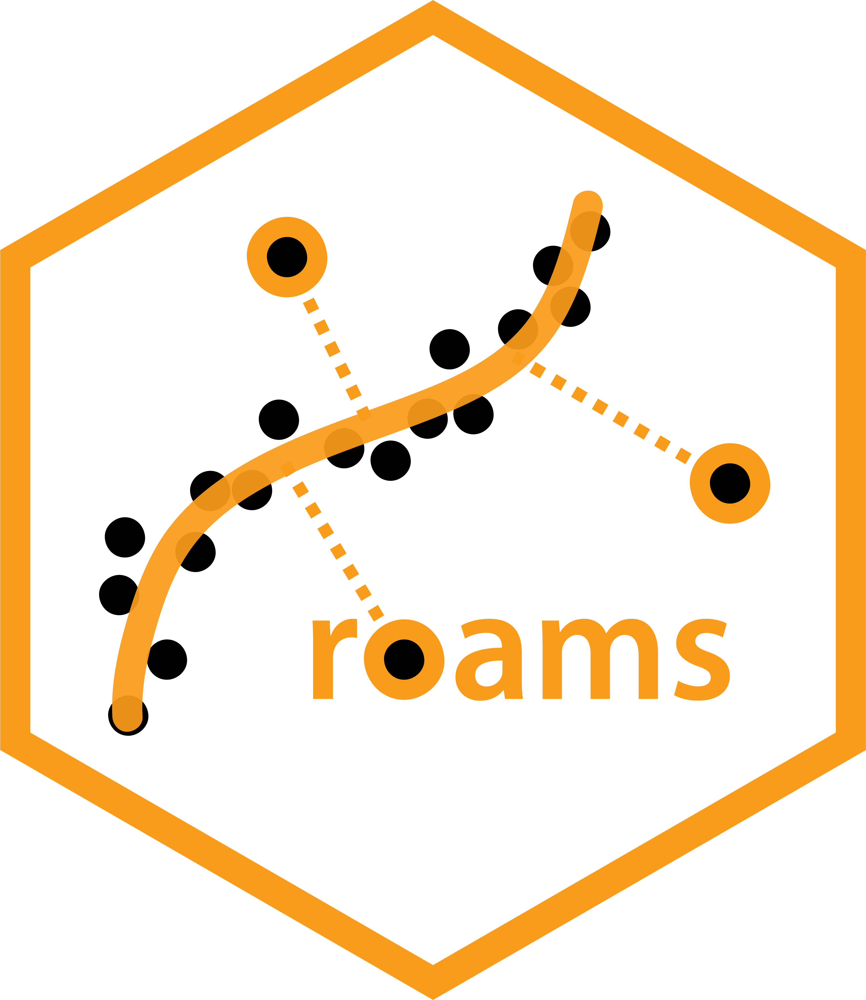

<!-- README.md is generated from README.Rmd. Please edit that file -->

```{r, include = FALSE}
knitr::opts_chunk$set(
  collapse = TRUE,
  comment = "#>",
  fig.path = "man/figures/README-",
  out.width = "100%"
)
```

# roams 

<!-- badges: start -->
<!-- badges: end -->

**roams** provides functions for estimating parameters and detecting outliers in state-space models using the ROAMS (Robust Outlier-Adjusted Mean-Shift) framework. 
It includes functionality for fitting benchmark models, visualizing model selection criteria, and evaluating in-sample and out-of-sample performance. 
Simulation tools for generating synthetic data under a first-differenced correlated random walk (DCRW) model are also included. 
Designed with flexibility for user-defined model structures via the `specify_SSM()` interface. 

See the corresponding ROAMS paper published in *Statistics and Computing* here: [https://doi.org/10.1007/s11222-026-10935-4](https://doi.org/10.1007/s11222-026-10935-4)

## Installation

You can install the development version of **roams** from GitHub with:

``` r
# install.packages("pak")
pak::pak("rajan-shankar/roams")
```

OR if using Windows:

``` r
# install.packages("devtools")
devtools::install_github("rajan-shankar/roams")
```


