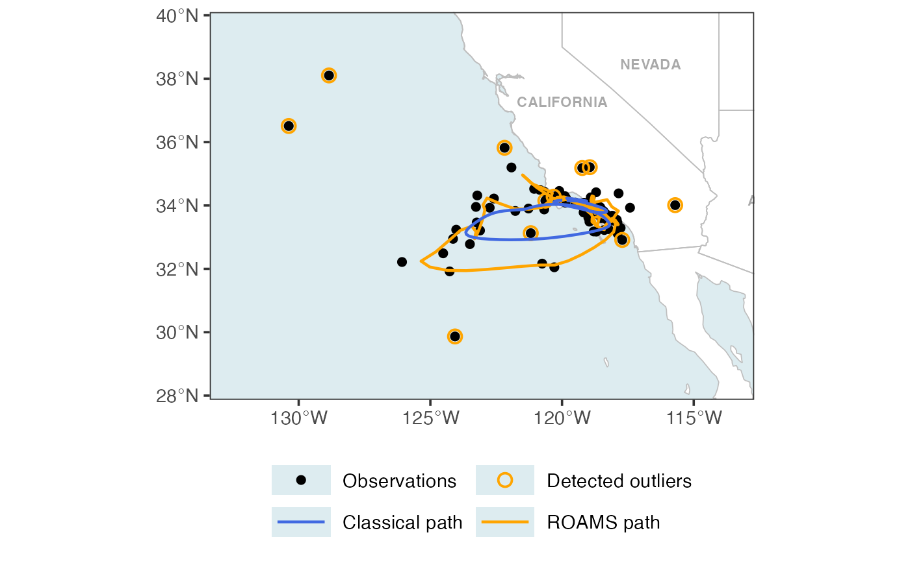
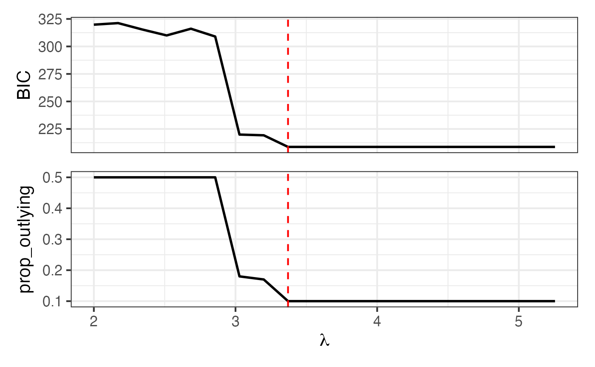
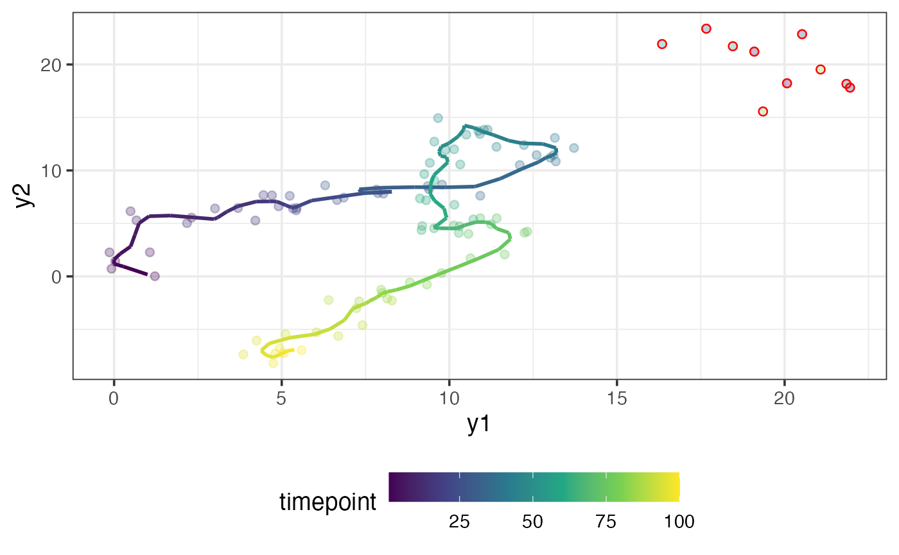
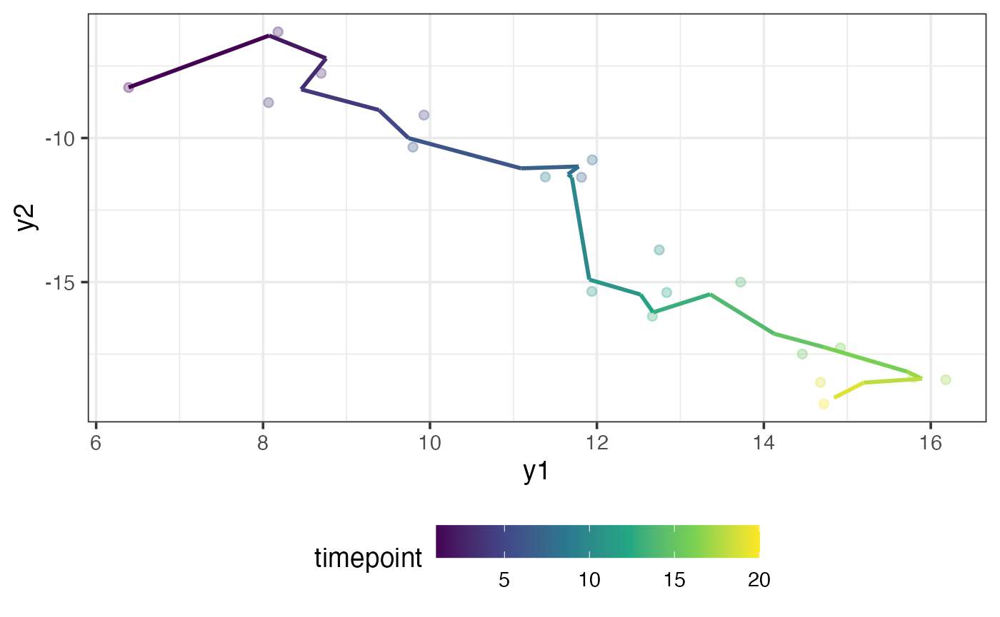
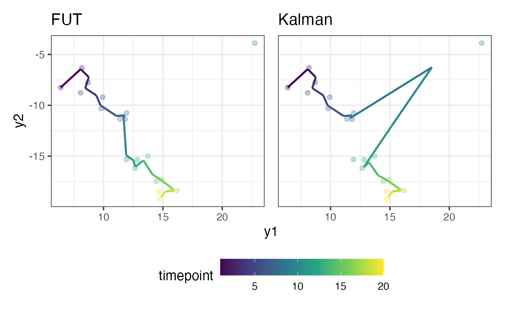

# Introduction

In this vignette, we provide a summary of the main R functions contained
in the `roams` package and how to use them. We’ll begin by simulating a
data set, fitting a model, inspecting results, and finally using the
model to perform out-of-sample (OOS) filtering.


Overview of `roams` functions

We start by loading the required packages and setting a simple ggplot2
theme for consistent plotting.

``` r

library(roams)
library(tidyverse)
library(patchwork)

theme_set(
  theme_bw(base_size = 14) + 
    theme(legend.position = "bottom",
          legend.key.width = unit(1.2, "cm"))
)
```

## Simulating data

`roams` provides a helper function
[`simulate_data_study1()`](https://rajan-shankar.github.io/roams/reference/simulate_data_study1.md)
which generates example data sets used in the simulations results of
Study 1 in Shankar et al. (2025). We use this function to simulate a
single sample (`samples = 1`) for each of the different sample sizes and
outlier settings, and extract specifically the *cluster* setting with
\\n=100\\ timepoints.

``` r

data = simulate_data_study1(samples = 1, seed = 12345) |> 
  filter(n == 100, setting == "cluster")
```

The data set contains a column `y` which contains an observation in each
row:

``` r

y = data$y[[1]]
head(y)
#>             [,1]        [,2]
#> [1,]  1.21665121  0.01718996
#> [2,]  0.03387945  1.43366185
#> [3,] -0.07748398  0.72068394
#> [4,] 20.07176363 18.22658579
#> [5,] -0.13745034  2.26740843
#> [6,]  1.06648254  2.27373266
```

As you can see, the observations are 2-dimensional. You can think of
each observation as a longitude/latitude coordinate of an object moving
through 2D space. We can plot these observations indexed by time:

``` r

plot_data = tibble(
  y1 = y[,1],
  y2 = y[,2],
  timepoint = 1:100
) 

ggplot(plot_data) +
  aes(x = y1, y = y2, colour = timepoint) +
  geom_point() +
  scale_colour_viridis_c()
```



The object first starts near the coordinate \\\[0,0\]\\, then it moves
in the positive \\\[y_1, y_2\]\\ direction, and then it loops around
before moving back in the the negative \\\[y_1, y_2\]\\ direction. In
the top right, there are a few observations scattered away from the main
trajectory taken by the object. We suspect that these points are
outliers.

## Fitting a ROAMS state-space model

Here are the state and observation equations for a linear Gaussian
state-space model:

\\ \begin{align} \boldsymbol{y}\_t &= \boldsymbol{A} \boldsymbol{x}\_t +
\boldsymbol{v}\_t \\ \boldsymbol{x}\_t &= \boldsymbol{\Phi}
\boldsymbol{x}\_{t-1} + \boldsymbol{w}\_t, \end{align} \\

where \\\boldsymbol{y}\_t\\ is the observation process,
\\\boldsymbol{x}\_t\\ is the state process, \\\boldsymbol{v}\_t \sim
N(\boldsymbol{0}, \boldsymbol{\Sigma}\_{\boldsymbol{v}})\\ and
\\\boldsymbol{w}\_t \sim N(\boldsymbol{0},
\boldsymbol{\Sigma}\_{\boldsymbol{w}})\\. The state-space model we want
to use to model our data is the first-differenced correlated random walk
(DCRW) model. The DCRW model has a 2-dimensional \\\boldsymbol{y}\_t\\
and a 4-dimensional \\\boldsymbol{x}\_t\\ because \\\boldsymbol{x}\_t\\
tries to capture the true location of the object at times \\t\\ and
\\t-1\\ (see Shankar et al. (2025) for more details). The matrices in
the DCRW model are given by

\\ \begin{align} \boldsymbol{\Phi} &= \left\[ \begin{matrix}
1+\phi&0&-\phi&0 \\ 0&1+\phi&0&-\phi \\ 1&0&0&0 \\ 0&1&0&0 \\
\end{matrix} \right\] \\ \boldsymbol{A} &= \left\[ \begin{matrix}
1&0&0&0 \\ 0&1&0&0 \end{matrix} \right\], \end{align} \\

and the error variance matrices are
\\\boldsymbol{\Sigma}\_{\boldsymbol{v}} =
\text{diag}(\sigma^2\_{\boldsymbol{v},1},
\sigma^2\_{\boldsymbol{v},2})\\ and
\\\boldsymbol{\Sigma}\_{\boldsymbol{w}} =
\text{diag}(\sigma^2\_{\boldsymbol{w},1}, \sigma^2\_{\boldsymbol{w},2},
0, 0)\\. We assume at time \\t=0\\, that \\\boldsymbol{x}\_0 \sim
N(\boldsymbol{\mu}\_0, \boldsymbol{P}\_0)\\, where \\\boldsymbol{\mu}\_0
= \[0,0,0,0\]\\ and \\\boldsymbol{P}\_0 = \text{diag}(10^2, 10^2, 10^2,
10^2)\\.

There are a total of 5 unknown parameters in the DCRW model:
\\\boldsymbol{\theta} := \[\phi,\sigma^2\_{\boldsymbol{w},1},
\sigma^2\_{\boldsymbol{w},2}, \sigma^2\_{\boldsymbol{v},1},
\sigma^2\_{\boldsymbol{v},2}\]\\. To specify this model, we define a
function `build_fn()` that takes in \\\boldsymbol{\theta}\\ as an
argument and returns \\\boldsymbol{x}\_0, \boldsymbol{P}\_0,
\boldsymbol{\Phi}, \boldsymbol{A},
\boldsymbol{\Sigma}\_{\boldsymbol{v}},
\boldsymbol{\Sigma}\_{\boldsymbol{w}}\\. The helper function
[`specify_SSM()`](https://rajan-shankar.github.io/roams/reference/specify_SSM.md)
is used inside `build_fn()` to help return these values in the correct
format.

``` r

build_fn = function(par) {
  
  phi_coef = par[1]
  Phi = diag(c(1+phi_coef, 1+phi_coef, 0, 0))
  Phi[1,3] = -phi_coef
  Phi[2,4] = -phi_coef
  Phi[3,1] = 1
  Phi[4,2] = 1
  
  A = diag(4)[1:2,]
  Sigma_w = diag(c(par[2], par[3], 0, 0))
  Sigma_v = diag(c(par[4], par[5]))
  
  mu0 = c(0,0,0,0)
  P0 = diag(rep(10^2, 4))
  
  specify_SSM(
    state_transition_matrix = Phi,
    state_noise_var = Sigma_w,
    observation_matrix = A,
    observation_noise_var = Sigma_v,
    init_state_mean = mu0,
    init_state_var = P0)
}
```

To fit the model using the ROAMS procedure, we use the function
[`roams_SSM()`](https://rajan-shankar.github.io/roams/reference/roams_SSM.md)
and pass in the observations `y` as well as our model specification
function `build_fn()`. Since \\\phi \in\[0,1\]\\ and
\\\sigma^2\_{\boldsymbol{w},1}, \sigma^2\_{\boldsymbol{w},2},
\sigma^2\_{\boldsymbol{v},1}, \sigma^2\_{\boldsymbol{v},2} \> 0\\, we
add in these parameter box constraints via the `lower` and `upper`
arguments. We provide initial parameter values \\\[0.5, 1, 1, 1, 1\]\\
and we set `num_lambdas = 20` to let
[`roams_SSM()`](https://rajan-shankar.github.io/roams/reference/roams_SSM.md)
automatically select a sequence of 20 \\\lambda\\ values to fit
candidate models.

``` r

model_list = roams_SSM(
  y = y, 
  init_par = c(0.5, rep(1, 4)), 
  build = build_fn, 
  num_lambdas = 20, 
  lower = c(0, rep(1e-12, 4)), 
  upper = c(1, rep(Inf, 4))
)
```

``` r

model_list
#> ROAMS SSM List with 20 models
#>  * Use best_BIC_model() or outlier_target_model() to extract a preferred model.
#>    - Or, simply use list indexing such as [[1]] to extract a single model.
#>  * Use autoplot() to visualize the models.
#>  * Use get_attribute() to extract attributes from the models.
```

## Inspecting the models

Once the models have been fit and assigned to the variable `model_list`,
we can plot BIC and proportion-outlying curves across the values of
\\\lambda\\ using the
[`autoplot()`](https://ggplot2.tidyverse.org/reference/autoplot.html)
function:

``` r

autoplot(model_list)
```



The exact BIC or proportion-outlying values can be obtained using the
[`get_attribute()`](https://rajan-shankar.github.io/roams/reference/get_attribute.md)
function:

``` r

get_attribute(model_list, "prop_outlying")
#>  [1] 0.50 0.50 0.50 0.50 0.50 0.50 0.18 0.17 0.10 0.10 0.10 0.10 0.10 0.10 0.10
#> [16] 0.10 0.10 0.10 0.10 0.10
```

To extract the model corresponding to the lowest BIC, we can use the
[`best_BIC_model()`](https://rajan-shankar.github.io/roams/reference/best_BIC_model.md)
function. We assign this model to the variable `final_model`:

``` r

final_model = best_BIC_model(model_list)
final_model
#> ROAMS SSM Model
#>  * Lambda: 3.371
#>  * Outliers Detected: 10%
#>  * BIC: 208.663
#>  * Log-Likelihood: -81.306
#>  * Iterations: 6
#> Use $ to see more attributes.
```

As shown above, printing `final_model` provides a brief summary of the
model. It tells us which \\\lambda\\ value was selected, the proportion
of timepoints detected as outlying, the BIC, log-likelihood, and the
number of ROAMS iterations.

Other model-specific attributes such as `par` (parameter estimates) can
be viewed using `$`:

``` r

final_model$par
#> [1] 0.5522448 0.1655666 0.2131430 0.3093632 0.2475860
```

By default, more detailed information such as estimates for the hidden
states are not included in the model object to save memory. However, we
need this information to plot the estimated states. To get this
information, we can use the
[`attach_insample_info()`](https://rajan-shankar.github.io/roams/reference/attach_insample_info.md)
function:

``` r

final_model = attach_insample_info(final_model)
```

Below, we use our `final_model` to plot the \`smoothed’ estimated
trajectory of the moving object as well as circle the observations
detected as outliers in red.

``` r

outliers = rowSums(abs(final_model$gamma)) != 0

plot_data = tibble(
  y1 = y[,1],
  y2 = y[,2],
  y1_model = final_model$smoothed_observations[,1],
  y2_model = final_model$smoothed_observations[,2],
  outliers = outliers,
  timepoint = 1:100
)

ggplot(plot_data) +
  aes(x = y1, y = y2, colour = timepoint) +
  geom_point(alpha = 0.3) +
  geom_path(aes(x = y1_model, y = y2_model), 
            linewidth = 1) +
  geom_point(data = plot_data |> filter(outliers),
             colour = "red", pch = 1) +
  scale_colour_viridis_c()
```



The fit looks good and the suspected outliers have been correctly
detected.

## Out-of-sample (OOS) filtering

The simulated data set that we generated contains another column named
`y_oos`, which contains \\n\_{\text{oos}} = 20\\ out-of-sample
observations. We will use our `final_model` to obtain filtered values
for `y_oos`.

The out-of-sample data has the same characteristics as the in-sample
data, except that it starts where the in-sample data ends. We re-define
our `build_fn()` to set the initial state mean \\\boldsymbol{\mu}\_0\\
to be our best guess of the hidden state at the last in-sample
timepoint, \\t=100\\:

``` r

final_model$smoothed_states[100,]
#> [1]  5.374293 -6.914360  5.149415 -7.047400
```

``` r

y_oos = data$y_oos[[1]]

build_fn_oos = function(par) {
  
  phi_coef = par[1]
  Phi = diag(c(1+phi_coef, 1+phi_coef, 0, 0))
  Phi[1,3] = -phi_coef
  Phi[2,4] = -phi_coef
  Phi[3,1] = 1
  Phi[4,2] = 1
  
  A = diag(4)[1:2,]
  Sigma_w = diag(c(par[2], par[3], 0, 0))
  Sigma_v = diag(c(par[4], par[5]))
  
  mu0 = final_model$smoothed_states[100,]
  P0 = diag(rep(10^2, 4))
  
  specify_SSM(
    state_transition_matrix = Phi,
    state_noise_var = Sigma_w,
    observation_matrix = A,
    observation_noise_var = Sigma_v,
    init_state_mean = mu0,
    init_state_var = P0)
}
```

Using this new state-space model specification, `build_fn_oos`, we can
do out-of-sample filtering using the
[`oos_filter()`](https://rajan-shankar.github.io/roams/reference/oos_filter.md)
function. We supply data `y_oos`, the model `final_model` (which is
needed for its parameter estimates), and our function `build_fn_oos`:

``` r

result = oos_filter(y_oos, final_model, build_fn_oos)

head(result$filtered_observations)
#>          [,1]       [,2]
#> [1,] 6.388546  -8.246328
#> [2,] 8.072338  -6.445772
#> [3,] 8.755492  -7.236791
#> [4,] 8.457210  -8.312808
#> [5,] 9.388451  -9.028853
#> [6,] 9.743224 -10.004715
```

Below, we plot the out-of-sample observations alongside our filtered
values. The fit is pretty good:

``` r

plot_data = tibble(
  y1 = y_oos[,1],
  y2 = y_oos[,2],
  y1_filter = result$filtered_observations[,1],
  y2_filter = result$filtered_observations[,2],
  timepoint = 1:20
)

ggplot(plot_data) +
  aes(x = y1, y = y2, colour = timepoint) +
  geom_point(alpha = 0.3) +
  geom_path(aes(x = y1_filter, y = y2_filter), 
            linewidth = 1) +
  scale_colour_viridis_c()
```



Notice that there are no visible outliers in the out-of-sample data.
Let’s see what happens to our filtered values if there is an outlier. We
can contaminate the 10\\^\text{th}\\ observation to be outlying:

``` r

y_oos[10,] = y_oos[10,] + c(10,10)
y_oos[10,]
#> [1] 22.746904 -3.882899
```

If the model passed to
[`oos_filter()`](https://rajan-shankar.github.io/roams/reference/oos_filter.md)
is of class `roams_SSM`, then by default the
[`oos_filter()`](https://rajan-shankar.github.io/roams/reference/oos_filter.md)
function uses the fast-updating threshold (FUT) filter (see Shankar et
al. (2025)) to do out-of-sample filtering. The FUT filter provides
robustness against out-of-sample outliers. If the usual Kalman filter is
desired, we can set the argument `threshold = Inf`. We try both filters:

``` r

result_FUT = oos_filter(y_oos, final_model, build_fn_oos)
result_kalman = oos_filter(y_oos, final_model, build_fn_oos, threshold = Inf)
```

Below, we plot the filtered values against the out-of-sample data (where
the 10\\^\text{th}\\ point has been contaminated) for both filtering
methods:

``` r

plot_data = tibble(
  y1 = y_oos[,1],
  y2 = y_oos[,2],
  y1_FUT = result_FUT$filtered_observations[,1],
  y2_FUT = result_FUT$filtered_observations[,2],
  y1_kalman = result_kalman$filtered_observations[,1],
  y2_kalman = result_kalman$filtered_observations[,2],
  timepoint = 1:20
)

p_FUT = ggplot(plot_data) +
  aes(x = y1, y = y2, colour = timepoint) +
  geom_point(alpha = 0.3) +
  geom_path(aes(x = y1_FUT, y = y2_FUT), 
            linewidth = 1) +
  ggtitle("FUT") +
  scale_colour_viridis_c()

p_kalman = ggplot(plot_data) +
  aes(x = y1, y = y2, colour = timepoint) +
  geom_point(alpha = 0.3) +
  geom_path(aes(x = y1_kalman, y = y2_kalman), 
            linewidth = 1) +
  ggtitle("Kalman") +
  scale_colour_viridis_c()

p_FUT + p_kalman + plot_layout(guides = "collect", axes = "collect")
```



As you can see, the FUT filter is able to ignore the outlier whereas the
Kalman filter gets pulled towards it.

## Summary

In this vignette, we demonstrated the core functionality of the `roams`
package through a complete end-to-end example. We began by simulating
bivariate time series data using
[`simulate_data_study1()`](https://rajan-shankar.github.io/roams/reference/simulate_data_study1.md),
then specified a state-space model (the DCRW model) through the helper
function
[`specify_SSM()`](https://rajan-shankar.github.io/roams/reference/specify_SSM.md).
Using
[`roams_SSM()`](https://rajan-shankar.github.io/roams/reference/roams_SSM.md),
we fitted a sequence of models across different values of the tuning
parameter \\\lambda\\ and identified the optimal model via the BIC
criterion.

We then explored how to inspect fitted models, extract key quantities
(such as parameter estimates and detected outliers), and visualise model
diagnostics using
[`autoplot()`](https://ggplot2.tidyverse.org/reference/autoplot.html)
and smoothed states using
[`attach_insample_info()`](https://rajan-shankar.github.io/roams/reference/attach_insample_info.md).

Finally, we illustrated how to use the fitted model for out-of-sample
(OOS) filtering, showing that the fast-updating threshold (FUT) filter
can effectively resist the influence of outliers compared to the
standard Kalman filter.

### References

Shankar, R., Wilms, I., Raymaekers, J., & Tarr, G. (2025). Robust
outlier-adjusted mean-shift estimation of state-space models.
<https://arxiv.org/abs/????.?????>
